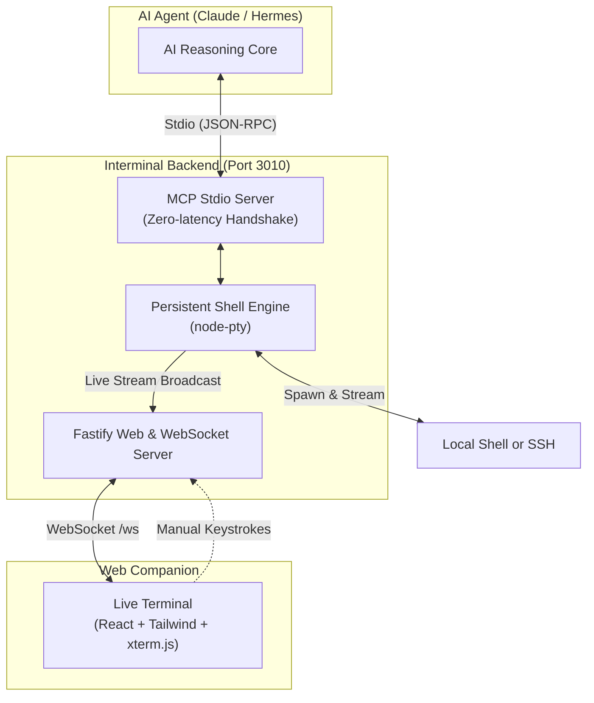

# Interminal ⚡

> **The Live Interactive Terminal Companion for AI Agents**

**Interminal** is a lightweight, full-duplex terminal companion built for AI Agent platforms (such as **Hermes Agent**, **Claude Desktop**, and other [Model Context Protocol (MCP)](https://modelcontextprotocol.io/) clients).

While your AI agent is running commands on your machine or over SSH, Interminal opens a real-time terminal window in your web browser (`http://localhost:3010`) where you can:
- 📺 **Watch live streaming execution** character-by-character with full ANSI colors.
- ⌨️ **Take over the keyboard manually** at any time (e.g. typing commands, answering confirmation prompts, `<Tab>` auto-completing, or pressing `Ctrl+C`).
- 🔄 **Preserve terminal session state** (`cd`, environment variables, virtualenvs, background jobs) across all consecutive AI actions.
- ⬆️ **Use full terminal history** with the <kbd>↑</kbd> and <kbd>↓</kbd> arrow keys just like your native terminal.

---

## 🚀 Quick Setup (1 Minute)

### 1. Clone & Build
```bash
git clone https://github.com/your-username/interminal.git
cd interminal
npm install
npm run build
```

---

## 🤖 Connecting to Your AI Agent

### With Hermes Agent
Add the following to your Hermes MCP configuration (e.g. in `~/.hermes/config.json` or your project's MCP config):

```json
{
  "mcpServers": {
    "interminal": {
      "command": "node",
      "args": [
        "/absolute/path/to/interminal/dist/backend/index.js"
      ]
    }
  }
}
```

### With Claude Desktop
Add the following to your Claude Desktop config (`~/Library/Application Support/Claude/claude_desktop_config.json` on macOS):

```json
{
  "mcpServers": {
    "interminal": {
      "command": "node",
      "args": [
        "/absolute/path/to/interminal/dist/backend/index.js"
      ]
    }
  }
}
```

> **✨ How it works:** When Hermes or Claude starts, it will automatically launch Interminal in the background. Simply open **[http://localhost:3010](http://localhost:3010)** in your browser to view and interact with your terminal live!

---

## 💻 Standalone Mode (No AI Agent)

You can also use Interminal as a standalone browser terminal:

```bash
npm start
```
Then visit **[http://localhost:3010](http://localhost:3010)**.

---

## 🛠️ MCP Tools Provided to AI Agents

| Tool | Description |
| :--- | :--- |
| **`execute_command`** | Executes a shell command in the persistent terminal, streams live output to the browser, and returns the exit code + text output to the AI. |
| **`send_input`** | Sends raw keystrokes or control sequences (e.g. `y\n` to accept prompts or `\x03` for `Ctrl+C`). |
| **`start_session`** | Switches or spawns a new terminal session (Local shell `/bin/zsh` or Remote `ssh user@host`). |
| **`get_session_status`**| Inspects the active terminal session, PID, and dimensions. |

---

## 🏗️ Architecture



---

## 👩‍💻 Development

Want to customize or develop Interminal?

- **Run backend with hot-reload:** `npm run dev:backend`
- **Run frontend Vite dev server:** `npm run dev:frontend`
- **Run both concurrently:** `npm run dev`
- **Run test suite:** `npm test`
- **Build production assets:** `npm run build`

---

## 📄 License
MIT
