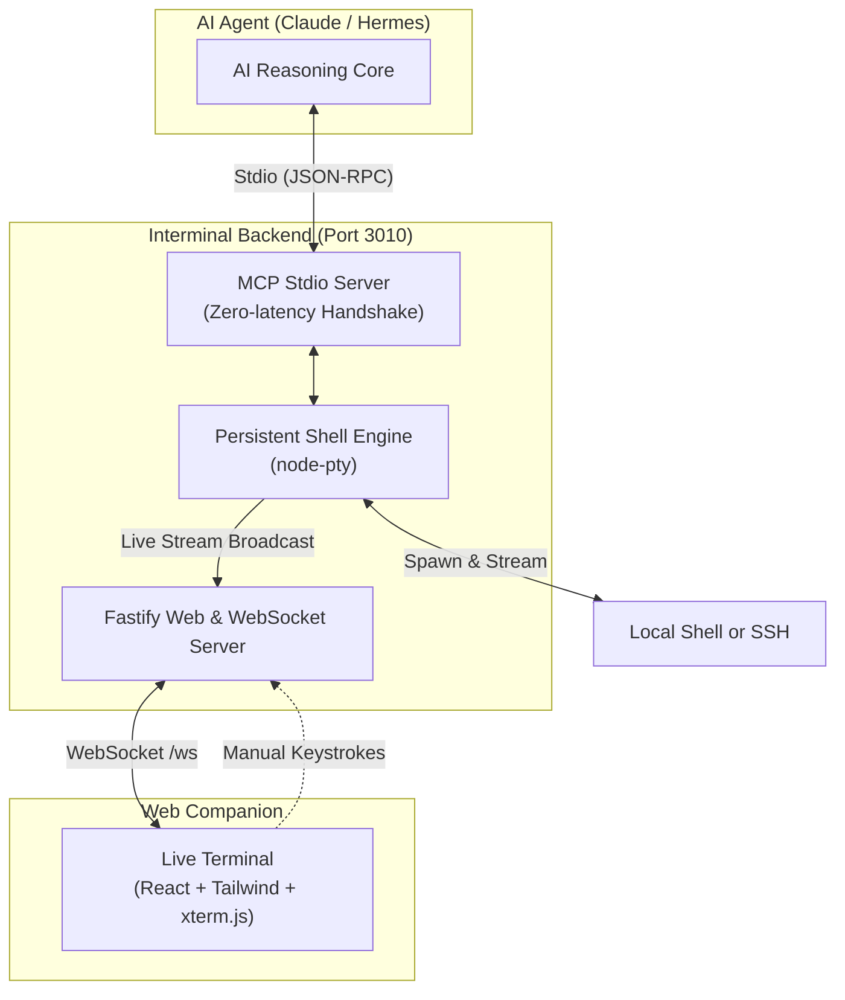

# Interminal ⚡

> **The Live Interactive Terminal Companion for AI Agents**

**Interminal** is a lightweight, full-duplex terminal companion built for AI Agent platforms (such as **Hermes Agent**, **Claude Desktop**, and other [Model Context Protocol (MCP)](https://modelcontextprotocol.io/) clients).

While your AI agent is running commands on your machine or over SSH, Interminal opens a real-time terminal window in your web browser (`http://localhost:3010`) where you can:
- 📺 **Watch live streaming execution** character-by-character with full ANSI colors.
- ⌨️ **Take over the keyboard manually** at any time (e.g. typing commands, answering confirmation prompts, `<Tab>` auto-completing, or pressing `Ctrl+C`).
- 🔄 **Preserve terminal session state** (`cd`, environment variables, virtualenvs, background jobs) across all consecutive AI actions.
- ⬆️ **Use full terminal history** with the <kbd>↑</kbd> and <kbd>↓</kbd> arrow keys just like your native terminal.

---

## 🚀 Quick Setup (1 Minute)

### 1. Clone & Build
```bash
git clone https://github.com/your-username/interminal.git
cd interminal
npm install
npm run build
```

---

## 🤖 Connecting to Your AI Agent

### With Hermes Agent
Add the following to your Hermes MCP configuration (e.g. in `~/.hermes/config.json` or your project's MCP config):

```json
{
  "mcpServers": {
    "interminal": {
      "command": "node",
      "args": [
        "/absolute/path/to/interminal/dist/backend/index.js"
      ]
    }
  }
}
```

### With Claude Desktop
Add the following to your Claude Desktop config (`~/Library/Application Support/Claude/claude_desktop_config.json` on macOS):

```json
{
  "mcpServers": {
    "interminal": {
      "command": "node",
      "args": [
        "/absolute/path/to/interminal/dist/backend/index.js"
      ]
    }
  }
}
```

> **✨ How it works:** When Hermes or Claude starts, it will automatically launch Interminal in the background. Simply open **[http://localhost:3010](http://localhost:3010)** in your browser to view and interact with your terminal live!

---

## 💻 Standalone Mode (No AI Agent)

You can also use Interminal as a standalone browser terminal:

```bash
npm start
```
Then visit **[http://localhost:3010](http://localhost:3010)**.

---

## 🛠️ MCP Tools Provided to AI Agents

| Tool | Description |
| :--- | :--- |
| **`execute_command`** | Starts a command and blocks until its explicit lifecycle marker reports the real exit code, or until the safety timeout. |
| **`start_command`** | Starts an interactive foreground command and immediately returns its unique `commandId`. |
| **`poll_command`** | Returns command state and output after an absolute character `offset`. |
| **`send_input`** | Sends input only to the running command identified by `command_id`; stale, unknown, and exited IDs are rejected. |
| **`cancel_command`** | Cancels the running command identified by `command_id` with `Ctrl+C`. |
| **`start_session`** | Switches or spawns a new terminal session (local POSIX shell or remote SSH shell). |
| **`get_session_status`**| Inspects the active terminal session, PID, busy state, and dimensions. |

Only one foreground command can own a PTY at a time. Completed command state is retained in a bounded 20-command history. Local and SSH command lifecycle tracking requires a POSIX-compatible shell with `printf`, `eval`, and `base64 -d`. Cancellation sends `Ctrl+C`; if a process ignores it, Interminal kills that PTY before releasing ownership, and the next command starts a fresh shell session.

### Blocking commands

Use `execute_command` for commands that need no agent input:

```json
{"command":"node scripts/sleep.js 5","timeout_ms":10000}
```

The call returns only after the command exits (or times out), includes output such as `You'd slept for 5 seconds`, and reports the shell's real `exitCode` and lifecycle `status`.

### Interactive commands

MCP is request/response based, so interactive work uses several short calls over server-managed command state:

1. `start_command({"command":"node scripts/prompt.js"})` and save the returned `commandId`.
2. `poll_command({"command_id":"<id>","offset":0})` until the name prompt appears; save `nextOffset`.
3. `send_input({"command_id":"<id>","input":"Alice\n"})`.
4. Poll from the saved offset until the age prompt, then send `30\n` with the same ID.
5. Poll until `status` is `exited`; the final output contains `Your name is Alice and you are 30 years old.`

Use each response's `nextOffset` for the next poll to avoid receiving output twice. `timeout_ms` is a safety boundary, not an idle-output completion heuristic.

---

## 🏗️ Architecture



---

## 👩‍💻 Development

Want to customize or develop Interminal?

- **Run backend with hot-reload:** `npm run dev:backend`
- **Run frontend Vite dev server:** `npm run dev:frontend`
- **Run both concurrently:** `npm run dev`
- **Run test suite:** `npm test`
- **Build production assets:** `npm run build`

---

## 📄 License
MIT
