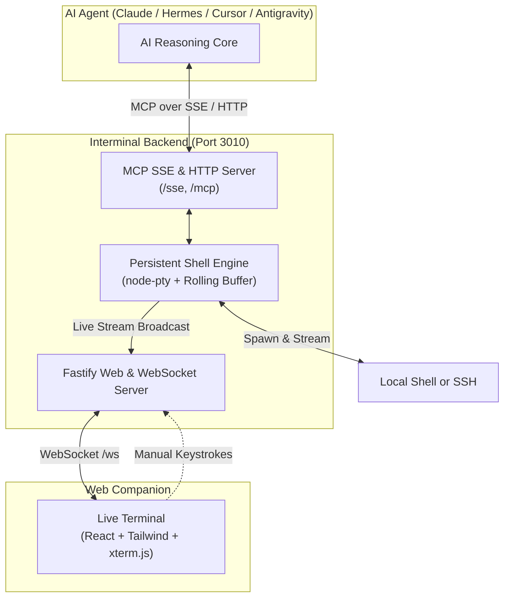

# Interminal ⚡

> **The Live Interactive Terminal Companion for AI Agents**

**Interminal** is a lightweight, full-duplex terminal companion built for AI Agent platforms (such as **Hermes Agent**, **Claude Desktop**, and other [Model Context Protocol (MCP)](https://modelcontextprotocol.io/) clients).

While your AI agent is running commands on your machine or over SSH, Interminal opens a real-time terminal window in your web browser (`http://localhost:3010`) where you can:
- 📺 **Watch live streaming execution** character-by-character with full ANSI colors.
- ⌨️ **Take over the keyboard manually** at any time (e.g. typing commands, answering confirmation prompts, `<Tab>` auto-completing, or pressing `Ctrl+C`).
- 🔄 **Preserve terminal session state** (`cd`, environment variables, virtualenvs, background jobs) across all consecutive AI actions.
- ⬆️ **Use full terminal history** with the <kbd>↑</kbd> and <kbd>↓</kbd> arrow keys just like your native terminal.

---

## 🚀 Quick Setup

### 1. Build
```bash
npm install
npm run build
```

### 2. Start Interminal in Your Terminal
```bash
npm start
```
You will see:
```text
┌────────────────────────────────────────────────────────┐
│  Interminal Companion Server Running                   │
│                                                        │
│  • Web UI:       http://localhost:3010                 │
│  • WebSocket:    http://localhost:3010/ws              │
│  • MCP SSE URL:  http://localhost:3010/sse             │
└────────────────────────────────────────────────────────┘
```
> 💡 **Why this is better:** You have full control over the process in your own terminal tab, you can see all server logs live, and you can stop it cleanly at any time with `Ctrl+C`.

---

## 🤖 Connecting Your AI Agent (MCP Configuration)

Add Interminal to your agent's MCP configuration using the SSE URL `http://localhost:3010/sse` (or `http://localhost:3010/mcp`):

#### Cursor (`~/.cursor/mcp.json` or Project Settings)
```json
{
  "mcpServers": {
    "interminal": {
      "url": "http://localhost:3010/sse"
    }
  }
}
```

#### Hermes Agent (`~/.hermes/config.json` or MCP settings)
```json
{
  "mcpServers": {
    "interminal": {
      "url": "http://localhost:3010/sse"
    }
  }
}
```

#### Claude Desktop / Antigravity / Cline / Roo Code / LibreChat
```json
{
  "mcpServers": {
    "interminal": {
      "url": "http://localhost:3010/sse"
    }
  }
}
```

---

## 🧠 Agent Skill Installation (Hermes, Claude)

To help your agent know how to interact with the companion UI, wait on long-running tasks, and handle sensitive prompts, install the `interminal` skill:

### For Hermes Agent
```bash
# Global install (recommended)
mkdir -p ~/.hermes/skills/interminal
cp skills/SKILL.md ~/.hermes/skills/interminal/SKILL.md

# Or local project install
mkdir -p .hermes/skills/interminal
cp skills/SKILL.md .hermes/skills/interminal/SKILL.md
```

### For Claude Code / Claude Desktop
```bash
# Claude Code (CLI) - append to CLAUDE.md
cat skills/SKILL.md >> CLAUDE.md

# Claude Desktop / Claude Projects
# Upload skills/SKILL.md to Project Knowledge or copy into Custom Instructions.
```

---

## 💻 Standalone Mode (No AI Agent)

You can also use Interminal as a standalone browser terminal:

```bash
npm start
```
Then visit **[http://localhost:3010](http://localhost:3010)**.

---

## 🛠️ MCP Tools Provided to AI Agents

| Tool | Description |
| :--- | :--- |
| **`write_to_terminal`** | Writes commands, interactive prompt responses, single keystrokes, or control codes (`\x03` for Ctrl+C). Defaults to auto-appending newline (`auto_enter: true`). |
| **`read_terminal`** | Reads clean plain-text terminal scrollback using cursor-based pagination (capped at 500 lines per call) with `has_more` indicators. |
| **`start_session`** | Switches or spawns a new terminal session (local POSIX shell or remote SSH shell). |
| **`get_session_status`**| Inspects the active terminal session, PID, busy state, and dimensions. |

### Running Commands & Reading Output

1. **Send command:**
   ```json
   { "input": "npm test" }
   ```
   *Note: `auto_enter` is `true` by default, executing the command immediately.*

2. **Poll output:**
   ```json
   { "cursor": 0, "limit": 500 }
   ```
   Returns:
   ```json
   {
     "text": "> interminal@0.1.0 test\n...",
     "cursor": 42,
     "has_more": false,
     "total_lines": 42
   }
   ```
   To continue reading subsequent output, provide the returned `cursor` in the next call: `{"cursor": 42}`. The returned `cursor` matches the index of the last line in the batch so the active shell prompt and any typed commands on that line are seamlessly captured.

3. **Interactive Prompts:**
   Send answers with the same tool: `{"input": "Alice"}` (auto-appends `\n`).

4. **Canceling or Interrupting (`Ctrl+C`):**
   Send interrupt control byte: `{"input": "\x03", "auto_enter": false}`.

---

## 🏗️ Architecture


```mermaid
flowchart TD
    subgraph AI ["AI Agent (Claude / Hermes / Cursor / Antigravity)"]
        Agent["AI Reasoning Core"]
    end

    subgraph Interminal ["Interminal Backend (Port 3010)"]
        MCP["MCP SSE & HTTP Server\n(/sse, /mcp)"]
        PTY["Persistent Shell Engine\n(node-pty + Rolling Buffer)"]
        WebBridge["Fastify Web & WebSocket Server"]
    end

    subgraph Browser ["Web Companion"]
        UI["Live Terminal\n(React + Tailwind + xterm.js)"]
    end

    Agent <-->|"MCP over SSE / HTTP"| MCP
    MCP <--> PTY
    PTY <-->|"Spawn & Stream"| Shell["Local Shell or SSH"]
    PTY -->|"Live Stream Broadcast"| WebBridge
    WebBridge <-->|"WebSocket /ws"| UI
    UI -.->|"Manual Keystrokes"| WebBridge
```

---

## 👩‍💻 Development

- **Run backend with hot-reload:** `npm run dev:backend`
- **Run frontend Vite dev server:** `npm run dev:frontend`
- **Run both concurrently:** `npm run dev`
- **Run test suite:** `npm test`
- **Build production assets:** `npm run build`

---

## 📄 License
MIT
