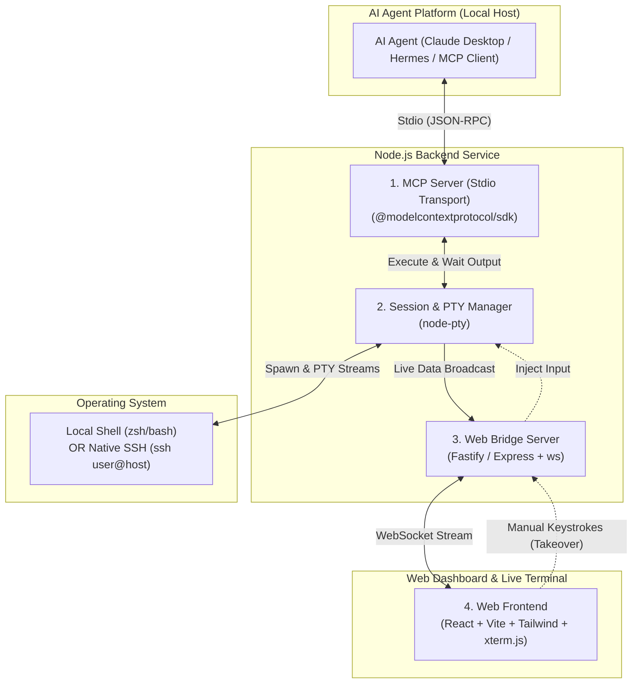

# System Design: Interactive Terminal Plugin for AI Agents (MVP)

## 1. Overview & MVP Scope

This tool is a lightweight, interactive terminal companion for AI agents (such as Claude Desktop, Hermes Agent, and other Model Context Protocol clients). 

It connects autonomous AI reasoning with real-time terminal execution, allowing humans to watch live commands streaming in a browser UI (`xterm.js`) while maintaining a persistent terminal session via `node-pty`.

### MVP Scope Decisions
* **Approval Model:** Native Agent Client Approval (Claude Desktop / Hermes handles tool-call confirmation; no duplicate approval modal needed in the MVP).
* **Terminal Engine:** `node-pty` handles both local shell execution and remote servers (by spawning `ssh user@host`).
* **Transport:** Stdio transport for the MCP server (runs locally on the same machine as the AI agent).
* **Streaming vs. Completion:** Real-time character streaming to Web UI via WebSockets, with buffered output & exit code resolution returned to the AI agent upon command completion.

---

## 2. High-Level Architecture Diagram



---

## 3. Core Components & Responsibilities

### 1. MCP Server Layer (Stdio)
* **Role:** Exposes terminal control tools to the AI agent over `stdio` using the standard Model Context Protocol.
* **Core Tools Provided:**
  * `execute_command(command: string)`: Sends a command to the active terminal, collects output until completion, and returns output + exit code.
  * `start_session(type: "local" | "ssh", target?: string)`: Spawns a new local or SSH terminal session.
  * `send_input(data: string)`: Sends raw text or control characters (e.g. `\x03` for `Ctrl+C`, `y\n` for prompts).
  * `get_session_status()`: Returns active directory, running state, and current buffer.

### 2. Session & PTY Manager (`node-pty`)
* **Role:** Manages the persistent pseudo-terminal (PTY) lifecycle.
* **Responsibilities:**
  * Spawns `/bin/zsh` (macOS), `/bin/bash` (Linux), or `ssh user@host` as a stateful child PTY process.
  * Preserves working directory (`cd`), environment variables (`export`), and background jobs across consecutive tool calls.
  * **Command Completion Detector:** Uses sentinel marker wrapping (e.g., `cmd; echo "__CMD_EXIT:$?__"`) to accurately detect when a command finishes and capture its exit code without terminating the shell.

### 3. Real-Time Web Bridge (HTTP + WebSocket)
* **Role:** Serves the frontend web assets and manages real-time bi-directional streaming.
* **Responsibilities:**
  * Listens on `http://localhost:<PORT>`.
  * Broadcasts live terminal output (`pty.onData`) instantly to all connected WebSocket clients.
  * Receives manual human keystrokes from the browser and forwards them to `pty.write(data)`.
  * Receives terminal resize events (`{ cols, rows }`) from `xterm.js` and calls `pty.resize(cols, rows)`.

### 4. Web Frontend (`xterm.js` + React)
* **Role:** The visual companion UI for the human operator.
* **Responsibilities:**
  * Renders terminal output with full ANSI color, text styles, and VT100 cursor control.
  * Automatically fits the browser window dimensions using `@xterm/addon-fit`.
  * Allows manual typing / keyboard takeover (e.g., answering interactive prompts, pressing `Ctrl+C`).
  * Shows connection status and session metadata.

---

## 4. Execution Sequence Flow

```mermaid
sequenceDiagram
    autonumber
    participant AI as AI Agent (Claude / Hermes)
    participant MCP as MCP Server
    participant PTY as node-pty Engine
    participant WS as WebSocket Bridge
    participant UI as Web UI (xterm.js)

    Note over AI,MCP: 1. Tool Call Initiation
    AI->>MCP: execute_command("ls -la && docker ps")
    
    Note over MCP,PTY: 2. Wrapped Execution
    MCP->>PTY: write("ls -la && docker ps; echo '__CMD_EXIT:'$?''\n")
    
    Note over PTY,UI: 3. Zero-Latency Real-Time Stream
    loop Live Output Streaming
        PTY-->>WS: onData(chunk)
        WS-->>UI: WebSocket broadcast(chunk)
        UI-->>UI: xterm.write(chunk) (Render live ANSI text/progress)
        Note over MCP: Accumulates chunk into memory buffer
    end
    
    Note over PTY,MCP: 4. Completion & Exit Code Parsing
    PTY-->>MCP: Marker detected ("__CMD_EXIT:0__")
    MCP-->>AI: Return cleaned output + exitCode: 0
```

---

## 5. Technology Stack & Packages

| Component | Framework / Library | Package Name | Purpose |
| :--- | :--- | :--- | :--- |
| **Runtime & Language** | Node.js (v18+) | `typescript`, `tsx`, `tsup` | Type-safe execution and build toolchain |
| **AI Protocol** | Model Context Protocol | `@modelcontextprotocol/sdk` | Implements MCP Stdio Server & tool definitions |
| **Terminal Engine** | node-pty | `node-pty` | Spawns persistent OS pseudo-terminals (PTY) |
| **Backend / Web Server** | Fastify (or Express) | `fastify`, `@fastify/websocket`, `@fastify/static` | HTTP server + WebSocket bridge + static file serving |
| **Frontend Framework** | React 18 + Vite | `react`, `react-dom`, `vite` | Fast SPA frontend build |
| **CSS / Styling** | Tailwind CSS | `tailwindcss`, `postcss`, `autoprefixer` | Modern, clean UI styling |
| **Terminal Emulator UI**| xterm.js | `@xterm/xterm`, `@xterm/addon-fit`, `@xterm/addon-web-links` | Browser-based terminal rendering and keyboard handling |

---

## 6. Proposed MVP Project Directory Structure

```text
interminal/
├── package.json
├── tsconfig.json
├── vite.config.ts
├── src/
│   ├── backend/
│   │   ├── index.ts                # Main entry point (starts MCP server & Web bridge)
│   │   ├── mcp/
│   │   │   ├── server.ts           # MCP Stdio Server setup & lifecycle
│   │   │   └── tools.ts            # MCP Tool definitions (execute_command, etc.)
│   │   ├── pty/
│   │   │   ├── pty-manager.ts      # node-pty wrapper & lifecycle
│   │   │   └── completion.ts       # Command boundary & exit code detector
│   │   └── server/
│   │       ├── web-server.ts       # Fastify / HTTP server setup
│   │       └── ws-bridge.ts        # WebSocket broadcasting & manual input relay
│   │
│   └── frontend/
│       ├── index.html              # Frontend entry HTML
│       ├── main.tsx                # React root mount
│       ├── App.tsx                 # Main layout & status header
│       ├── components/
│       │   └── TerminalView.tsx    # xterm.js container & WebSocket connector
│       └── styles/
│           └── globals.css         # Tailwind base styles
└── README.md
```

---

## 7. Key Implementation Mechanisms (MVP)

1. **Unified Local vs. Remote SSH:**
   - For local session: `pty.spawn(process.env.SHELL || '/bin/zsh', [], options)`.
   - For SSH session: `pty.spawn('ssh', [targetHost], options)`.
   - Both utilize the exact same PTY lifecycle and stream handlers.

2. **Command Completion & Exit Code Detection (OSC 133):**
   - In interactive shell sessions, standard child process `exit` events do not fire after each command because the shell stays alive.
   - Interminal uses standard **OSC 133 Semantic Prompt escape codes** injected via shell hooks (`preexec`/`precmd` in Zsh, `PROMPT_COMMAND` in Bash).
   - Commands are sent directly without wrappers (`pty.write("${command}\n")`).
   - The stream parser detects `\x1b]133;C\x07` (command start) and `\x1b]133;D;<exit_code>\x07` (command complete with return code), allowing clean exit code extraction and output sanitization for the MCP client.

3. **Dual Input Handling (AI + Human Keyboard):**
   - AI sends commands via `execute_command`.
   - Human keystrokes from `xterm.onData` in the browser are forwarded via WebSocket into `pty.write(data)`.
   - Both inputs go to the same master PTY seamlessly.
